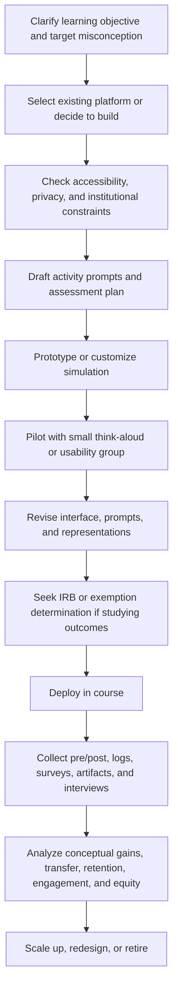
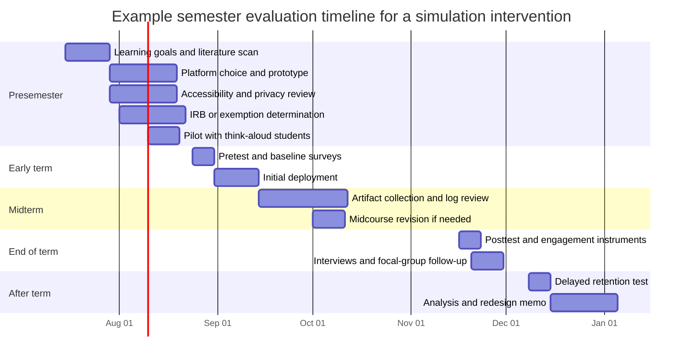

# Physics Simulations for STEM Faculty in the AI Era

## Executive summary

Physics simulations are now a mainstream instructional technology rather than a niche supplement. The strongest evidence supports them for conceptual learning when instructors need to make invisible mechanisms visible, compress time, manipulate variables cleanly, or let students explore systems that are expensive, dangerous, slow, or physically inaccessible in a conventional lab. Recent meta-analyses and reviews show three especially important patterns: physical and virtual investigations are often roughly equivalent for conceptual knowledge overall; deliberately combining real and virtual experiments in physics tends to outperform real-only approaches with a moderate overall effect; and virtual investigation is especially advantageous when tactile information is not central to the concept under study. citeturn20view0turn19view0turn37search4

The evidence is also nuanced. Simulations are most consistently effective for conceptual understanding, representational fluency, and guided inquiry. They are less complete substitutes for goals tied to apparatus handling, calibration, troubleshooting of physical hardware, and the tacit know-how that comes from manipulating real materials. This is why the best recent reviews increasingly argue for *strategic complementarity* rather than blanket replacement: use simulations where abstraction, repetition, or safety matter most, and preserve physical experimentation where touch, measurement messiness, and procedural skill are learning goals. citeturn19view0turn20view0turn25search2turn40search2

Platform choice should be driven by instructional intent, not brand familiarity. PhET is strongest for research-based, ready-to-use conceptual simulations; Open Source Physics and Easy Java/JavaScript Simulations are powerful when faculty want modifiable, pedagogically oriented models with relatively low barriers; VPython remains unusually good for getting students to *build* three-dimensional computational models early; Jupyter and the broader Python ecosystem are ideal for notebook-centric modeling, data, and AI integration; Geant4 and COMSOL are research-grade environments suited to upper-level, specialized, or research-linked teaching; and MATLAB/Simulink is often the best fit when simulation instruction is embedded in engineering-style modeling and institutional licensing ecosystems. citeturn9search1turn27search0turn27search6turn6search17turn13search3turn26search0turn28search0turn28search1

A central practical lesson for faculty is that the highest costs are often *not* software licenses. For open and low-cost platforms, the hidden costs are faculty time, validation, accessibility work, documentation, browser compatibility, version control, data privacy review, and assessment design. PhET’s own development documentation offers a useful benchmark: a moderately complex polished simulation can require roughly 160 hours of design, 500 or more hours of development, and about 40 hours of testing. That is a reminder that pedagogically robust simulations are engineered products, not just code artifacts. citeturn7search0turn40search2

The AI-enhanced-coding revolution materially changes this landscape. Official toolchains now support code generation, refactoring, repository explanation, documentation drafting, test generation, agentic project editing, and domain-specific modeling help. GitHub Copilot, Claude Code, OpenAI Codex CLI, MATLAB Copilot, Simulink Copilot, and COMSOL’s integrated chatbot all move parts of simulation development closer to natural-language workflows. In parallel, symbolic-regression tools such as AI Feynman and PySR are lowering barriers to interpretable model discovery, while optimization frameworks such as Optuna and COMSOL surrogate-model workflows support faster parameter tuning and black-box optimization. citeturn13search0turn13search6turn30search0turn30search11turn18search1turn18search10turn18search0turn18search13turn15search0turn15search5turn15search2turn18search2

For teaching, this creates real opportunities and serious risks. AI can dramatically reduce boilerplate and speed prototyping, but it can also hallucinate the physics, mis-handle units, conceal invalid assumptions, generate inaccessible interfaces, and encourage students to outsource thinking. A recent randomized field experiment with developers found meaningful productivity gains from AI coding assistance, while a randomized controlled trial in an undergraduate physics course found that a carefully scaffolded AI tutor improved learning, engagement, and motivation relative to in-class active learning. At the same time, recent higher-education syntheses and software-engineering-education research show that AI misuse is now strongly shaped by assessment design and clarity of expectations. citeturn14search0turn14search8turn17view0turn14search3turn14search12

The best near-term faculty strategy is therefore a tiered one. Start with validated simulations when they already exist. Build or customize only when the learning goal demands it. Use AI as an accelerator for drafting, debugging, documentation, and translation—but only inside a workflow that includes physics validation, accessibility checks, pilot testing, and disciplined evaluation. This report is also aligned with the project brief’s emphasis on the emerging possibility that faculty can increasingly author or adapt PhET-style simulations themselves in the AI era. fileciteturn0file0

## How physics simulations evolved and what platforms matter now

Modern instructional physics simulations emerged from at least four overlapping traditions. One came from research and engineering toolkits, exemplified by Geant4, released in 1998 as a general toolkit for simulating the passage of particles through matter. Another came from student-friendly computational modeling environments, notably VPython around 2000, which was designed so beginners could write programs with real-time 3D scientific graphics. A third came from pedagogically oriented authoring ecosystems such as Open Source Physics and Easy Java Simulations in the early 2000s. A fourth came from research-based conceptual interactives, above all PhET, which began in 2002 and later expanded well beyond physics into chemistry, biology, earth science, and mathematics. citeturn26search4turn26search0turn6search17turn27search16turn27search0turn9search1

Over the last decade, the center of gravity has shifted from Java and Flash applets toward HTML5, cloud-accessible notebooks, customizable web simulations, instrumented APIs, mobile/offline delivery, and increasingly accessible interfaces. PhET now explicitly emphasizes research-based design, broad classroom use, customizable tools, inclusive design, and offline access. Jupyter has become a de facto substrate for computational notebooks that combine live code, equations, text, and visualizations. Commercial ecosystems have also become more “teaching deployable”: COMSOL supports simulation applications via Application Builder and server licensing, while MathWorks offers campus-wide and teaching licenses along with AI copilots tuned to MATLAB and Simulink. citeturn40search2turn9search0turn13search3turn42search1turn28search1turn18search1turn18search10

The most useful way for faculty to think about the platform landscape is by distinguishing between simulations that are primarily for **conceptual exploration**, platforms for **student or instructor modeling**, and environments for **high-fidelity scientific or engineering simulation**. The first category supports broad STEM instruction at scale; the second is especially valuable when computational modeling itself is a learning goal; the third is strongest when instruction is tied to authentic domain practice, advanced electives, capstones, or research experiences. citeturn9search1turn27search0turn6search17turn26search0turn28search0

| Platform | Historical role and current position | Best instructional use | Authoring burden | Cost and maintenance posture | Representative sources |
|---|---|---|---|---|---|
| **PhET** | Research-based interactive simulations project founded in 2002; now spans multiple STEM disciplines and supports customizable and inclusive simulations | Introductory and intermediate conceptual learning, demos, guided inquiry, homework, clicker activities, conceptual labs | **Low** if using existing sims; **medium** if customizing through Studio or PhET-iO | Free for noncommercial use; open source/source availability varies by component; hidden cost is activity design and local integration rather than licensing | citeturn9search1turn28search3turn7search18turn40search2 |
| **Open Source Physics and EJSS** | Open pedagogical ecosystem built around modeling and simulation; EJSS lowers programming barriers for faculty and students | Faculty-authored teaching models, modifiable virtual labs, student modeling projects | **Medium** | Open and low-cost in license terms; maintenance depends on who owns the code and how polished the deployment must be | citeturn27search0turn27search6turn27search16 |
| **VPython and GlowScript** | Early 3D scientific graphics environment for students with little prior programming experience | Computational modeling in mechanics, electromagnetism, astronomy, and 3D kinematics | **Medium** for faculty; **moderate-to-high** for students depending on prior coding | Open ecosystem with relatively low direct cost; maintenance burden lies in instructional support and code debugging | citeturn6search17 |
| **Jupyter and Python stack** | Notebook-based computational environment combining code, narrative, equations, and visualization | Modeling, data-rich labs, parameter sweeps, AI-assisted authoring, reproducible assignments | **Medium** to **high** depending on ambition | Open source and flexible; maintenance can be substantial if environments, packages, grading, and accessibility are not centrally supported | citeturn13search3 |
| **Geant4** | Research-grade particle-transport toolkit released in 1998; widely used across high-energy, nuclear, medical, and space science | Advanced electives, detector physics, medical physics, research-linked instruction, authentic Monte Carlo workflows | **High** | Free software, but very high validation and technical overhead; best where fidelity justifies the setup cost | citeturn26search0turn26search4turn26search7turn26search8 |
| **COMSOL Multiphysics** | Commercial multiphysics environment with app deployment, server licensing, and now integrated chatbot and surrogate-model tooling | Upper-level engineering physics, multiphysics modeling, design apps, capstones, research-linked teaching | **Medium** to **high** | Proprietary; centralized license management and server deployment can scale teaching but add administrative overhead | citeturn28search0turn42search1turn42search8turn18search0turn18search2 |
| **MATLAB, Simulink, and companion tools** | Large institutional ecosystem for numerical computing and model-based design; now includes AI copilots | Engineering-oriented dynamics, controls, signal processing, system simulation, computation courses | **Medium** | Proprietary but often institutionally supported through campus-wide or teaching licenses; lower local maintenance where campus support is strong | citeturn28search1turn18search1turn18search10 |

*Interpretive note:* the “authoring burden” and “cost posture” columns are analytical judgments derived from the cited platform architectures, licensing models, deployment features, and the degree to which polished teaching use requires local coding, validation, and support. citeturn42search1turn28search1turn7search0

For most STEM faculty, one platform family is usually not enough. A robust departmental portfolio often uses PhET or similar validated interactives for foundational concepts, notebook-based Python work for analysis and student modeling, and only selective adoption of research-grade tools such as COMSOL or Geant4 when there is a clear payoff in authenticity, vertical curricular coherence, or research integration. citeturn9search1turn13search3turn26search0turn28search0

## What the evidence says about learning and engagement

The empirical record is strongest when one distinguishes among **conceptual understanding**, **procedural laboratory skill**, and **engagement or motivation**. Across reviews, simulations tend to be reliably positive for conceptual understanding, often positive for engagement and motivation, and mixed as replacements for procedures that depend on tactile, sensorimotor, or instrument-specific experience. This pattern appears from secondary school through undergraduate physics. citeturn25search2turn20view0turn19view0turn37search4

A particularly important result from the broader literature is that “virtual versus physical” is often the wrong question. A 2023 meta-analysis of 35 studies comparing physical and virtual investigation found no overall conceptual advantage for either mode, but virtual investigation was more effective for adults and in contexts where touch did not add relevant conceptual information. A 2025 physics-specific meta-analysis found that combining real and virtual experiments produced a moderate positive effect on learning achievement relative to real experiments alone, with stronger benefits for abstract and complex concepts and for theoretically designed sequences. citeturn20view0turn19view0

At the study level, several findings remain especially influential. Finkelstein and colleagues’ classic undergraduate circuits study found that substituting a simulation for part of a real-equipment preparation sequence led students to build real circuits just as fast and explain them better. More recent work in secondary-school physics, including a quasi-experimental study in Malawi, showed improved academic achievement and motivation with PhET-based learning. Review work by Banda and Nzabahimana concluded that the PhET literature provides robust evidence for gains in conceptual understanding, especially when simulations are embedded in active learning rather than used as isolated visual aids. citeturn4search4turn23search1turn25search2

| Population and level | Intervention | Design | Main result | Interpretation for faculty | Source |
|---|---|---|---|---|---|
| Introductory undergraduate physics | Circuit simulations used in place of some real-equipment work | Comparative experimental study | Students who learned with the simulation constructed real circuits at least as quickly and explained them better | Simulations can outperform real apparatus for conceptual preparation even when later transfer to physical equipment matters | citeturn4search4 |
| Undergraduate physics at two universities | Virtual versus hands-on labs | Comparative study | Virtual labs were found to be as effective as hands-on labs on targeted outcomes | Virtual labs can substitute for some conceptual lab goals, though not necessarily all procedural goals | citeturn3search8 |
| Review of 31 quasi-experimental or experimental studies in physics | PhET integration across topics and levels | Literature review | Robust evidence that PhET enhances conceptual understanding and works across active-learning settings | The question is less “whether simulations work” than “how they are integrated” | citeturn25search2 |
| Secondary-school physics in Malawi | PhET-based learning for oscillations and waves | Quasi-experimental non-equivalent groups | Improved achievement and motivation | Simulations can support both cognition and affect in resource-constrained secondary contexts | citeturn23search1 |
| STEM studies, 35-study meta-analysis with many physics investigations | Physical versus virtual investigation | Meta-analysis | No overall conceptual advantage for either mode; virtual favored for adults and when touch was irrelevant | Choose the medium based on learning goal, age, and role of tactile feedback, not ideology | citeturn20view0 |
| Physics, 27 independent studies | Combined real and virtual experiments | Meta-analysis | Moderate positive effect relative to real-only instruction; strongest for abstract/complex content and well-designed sequences | Blended sequences are often the highest-value design for physics courses | citeturn19view0 |
| Grade 7 science/physics contexts | Computer-based inquiry environments | Quasi-experimental pre/post design | Greater gains in conceptual understanding, inquiry skills, and motivation than regular classrooms | K–12 benefits are strongest when simulations are part of inquiry pedagogy, not mere demonstration | citeturn23search2 |

A newer, very recent meta-analysis focused specifically on PhET in physics reported a large overall effect size across studies published from 2018 to 2023. Because it is new, field-specific, and methodologically downstream of earlier syntheses, it is best read as *supportive but not yet definitive*. Still, it is directionally consistent with the stronger parts of the existing literature. citeturn23search17turn25search2

The engagement evidence is positive but methodologically less uniform than the conceptual-learning evidence. PhET’s research program and related studies have long argued that well-designed simulations support “engaged exploration,” and interview-based studies show that affordances, cues, and feedback can keep students productively active. Adams’ work and later reviews also point to a recurring pattern: students often report high enjoyment, motivation, and willingness to explore, but those affective benefits are most educationally valuable when instructors convert exploration into explanation, generalization, and reflection. citeturn4search1turn4search13turn11search2turn40search2

A practical takeaway follows. Instructors should avoid overgeneralizing from the phrase “simulations improve learning.” What the best evidence actually says is narrower and more actionable: **simulations improve learning when they are chosen for the right representational problem, embedded in sufficiently guided tasks, aligned to assessment, and used in a sequence that makes sense for the underlying phenomenon and course goals.** citeturn25search2turn12search0turn12search11

## Why simulations can help and when they fail

The learning sciences behind simulations are not mysterious. Simulations work partly because they instantiate a guided form of inquiry or experiential learning in which students can vary parameters, observe consequences, and revise mental models. But the strongest contemporary reviews are careful on one point: inquiry is not most effective when it is minimally guided. Instead, simulation-based inquiry learning works best when it includes prompts, sequencing, feedback, and sometimes direct instruction at key junctures. A 2022 systematic review of guidance in simulation-based inquiry learning and a 2023 review by de Jong both argue for combining inquiry with explicit guidance rather than treating them as opposites. citeturn12search0turn12search11turn20view0

PhET’s design research adds a more specific theory: **implicit scaffolding**. In this framework, the simulation itself guides students through affordances, constraints, cues, and feedback without overloading them with instructions. The goal is not unguided discovery but guided agency—students feel like they are exploring, yet the environment is subtly engineered so their exploration is likely to be productive. This helps explain why some simulations feel powerful while others feel chaotic or merely entertaining. citeturn12search2turn12search6turn11search2turn40search2

A second key theory is **multiple external representations**. Physics learning depends on coordinating equations, graphs, free-body diagrams, field lines, animations, particle views, and verbal explanations. Simulations can place these representations side by side and dynamically link them, making it easier for students to see invariants and causal relationships. A recent review of multiple representations in undergraduate physics highlights this as central to modern physics learning, and many of PhET’s best-known strengths—such as making microscopic or invisible entities visible—fit this logic directly. citeturn11search7turn11search11turn4search17

A third mechanism is **cognitive load management**. Well-designed simulations reduce extraneous load by simplifying interfaces, stripping away unnecessary text, and letting students focus on the conceptual relation that matters. This is one reason virtual environments can beat or match real labs for conceptual outcomes: real equipment often absorbs attention through setup complexity, noise, or procedural demands that are educationally valuable in some contexts but distracting in others. Even the recent AI-tutor trial in undergraduate physics made “managing cognitive load” one of its explicit design principles, showing how this older learning-sciences insight now informs both simulations and AI tutoring. citeturn19view0turn17view0

Embodiment remains an important qualification. The 2023 meta-analysis of physical versus virtual investigation found that tactile information matters when it is conceptually relevant. In those cases, physical investigation can confer an advantage or at least remove the virtual advantage. This means “more realistic” is not always better, but neither is “more virtual.” The proper question is whether the sensory and motor channels present in the activity are carrying information that helps students form the targeted concept. citeturn20view0

The common failure modes follow directly from these theories. Simulations fail when the interface is too complex, the representational mapping is unclear, the inquiry task is under-scaffolded, the debrief is missing, or the activity is disconnected from assessment. PhET’s own guidance is blunt on one point that faculty often underestimate: most students do not learn much if instructors simply tell them to “go home and play” with a simulation absent motivation and structure. Simulations are not magic; they are design-intensive learning environments whose benefits depend on what surrounds them. citeturn40search2turn12search0turn12search11

## Equity, accessibility, and sustainability

Equity and accessibility issues should be treated as central design criteria, not downstream add-ons. The strongest current examples come from PhET’s inclusive design work, which has been systematically expanding alternative input, interactive highlights, pan and zoom, basic sounds, core description, and in-simulation language selection. PhET explicitly frames these as “modal parity” features—an attempt to put what learners can see, hear, and feel on more equal footing. That orientation is consistent with the current W3C WCAG framework, whose core principles are that content should be perceivable, operable, understandable, and robust. citeturn8search0turn8search2turn36search0turn36search3

The broader literature shows that the field is making progress but remains uneven. A 2024 review of accessibility in virtual laboratories that synthesized 36 empirical studies concluded that accessibility and inclusivity remain underdeveloped relative to the growth of virtual lab adoption, with a large share of the evidence coming from higher education and engineering. In other words, the existence of a digital environment does not automatically make it inclusive. Screen-reader compatibility, keyboard navigability, focus visibility, sonification, captioning, low-bandwidth options, device compatibility, and cognitive-load management all require intentional design and testing. citeturn10search2turn36search1

Digital inequality also remains a real constraint. Remote and virtual labs can expand access for students who cannot reach a physical laboratory because of disability, commuting, scheduling, family care obligations, or geography. But these gains can be offset by unstable internet, inadequate devices, inaccessible home environments, or low institutional support. Recent remote-lab research focused on digital inequalities shows that these barriers shape equitable participation even when the core instructional technology is sound. citeturn10search4turn10search9

Three concrete design choices improve equity immediately. First, prefer tools that work offline or in low-bandwidth settings when possible. PhET’s desktop and app-based offline access is one strong example. Second, reduce account friction and privacy exposure. PhET explicitly notes that student accounts are not required to use the simulations, which lowers both access barriers and privacy complexity. Third, exploit multilingual infrastructure: translator networks and in-simulation language options matter materially for global and multilingual classrooms. citeturn9search0turn40search3turn8search1

Cost and maintenance tradeoffs are equally important because inaccessible or unsustained tools become *de facto* equity problems. A department may adopt an open tool because it is free, only to discover later that the local support burden falls on a single faculty member or postdoc. Conversely, a proprietary platform may be worth the cost if campus support, license management, and curricular integration are robust enough to make the experience dependable and scalable. citeturn7search0turn28search1turn42search1turn42search8

| Approach family | Direct licensing cost | Hidden costs | Typical maintenance burden | Best fit |
|---|---|---|---|---|
| **Ready-made OER simulations** | Usually low to none for instructional use | Activity design, alignment, accessibility review, local LMS integration | **Low to medium** | High-enrollment foundational courses, gateway STEM, broad access needs |
| **Faculty-coded notebook or VPython simulations** | Usually low | Faculty time, debugging, environment management, documentation, grading workflows | **Medium to high** | Computation-rich courses where modeling is itself a learning goal |
| **OSP or EJSS custom teaching apps** | Usually low | Authoring time, QA, browser testing, upkeep by local owner | **Medium** | Faculty who want modifiable teaching models without full software-engineering overhead |
| **Commercial multiphysics and model-based platforms** | Medium to high, usually institutional | License administration, training, server setup, student onboarding | **Medium to high** | Upper-level and research-linked courses where fidelity and deployment justify cost |
| **Research-grade open toolkits** | Low license cost, high expertise cost | Validation, compilation, domain-specific training, example management, support | **High** | Advanced electives, capstones, and research apprenticeships |

*Interpretive note:* these categories are qualitative because institutional pricing structures vary and vendors often use campus, server, or negotiated academic licensing rather than uniform public list prices. What most affects sustainability is usually not sticker price alone but the combination of support model, validation burden, and personnel continuity. citeturn28search1turn42search1turn42search11turn7search0

One especially useful sustainability lesson comes from PhET’s own internal process. The project reports that each simulation undergoes multiple student think-aloud interviews and substantial design, development, and testing. Faculty do not need to replicate this full pipeline for every local innovation, but they should internalize the principle: **pedagogical quality requires usability testing and revision.** A locally authored simulation that is never piloted is not actually “low cost”; it simply defers its costs to student confusion and weak learning. citeturn40search2turn7search0

## How AI is changing simulation authoring, teaching, and assessment

AI is changing simulation work at five distinct layers: code generation and refactoring; documentation and codebase explanation; model discovery; parameter tuning and surrogate modeling; and student-facing tutoring. The official developer ecosystems matter here because they show that this is no longer a fringe workflow. GitHub Copilot documentation now emphasizes agentic coding, repository exploration, diagram creation, and table generation. OpenAI’s Codex CLI is explicitly built to read, modify, and run code locally. Claude Code is designed to understand a codebase, execute routine tasks, and handle git workflows. MathWorks and COMSOL now offer domain-specific AI assistants embedded in their modeling environments. citeturn13search0turn13search8turn13search6turn13search2turn30search0turn30search11turn18search1turn18search10turn18search0

This matters pedagogically because simulation production has historically been bottlenecked by software labor. AI does not eliminate that labor, but it can compress the costs of boilerplate code, documentation, interface wiring, test scaffolds, translation drafts, and platform-specific syntax. In a controlled experiment reported in 2023, developers using GitHub Copilot completed a programming task about 55.8% faster. A 2025 paper based on field experiments at Microsoft, Accenture, and a Fortune 100 company similarly found meaningful productivity gains in software work with generative AI. Those results cannot be transferred naïvely to educational simulations, but they do support the basic premise that faculty and course teams can now move faster from idea to prototype. citeturn14search0turn14search8

The most interesting AI contribution for physics specifically may be **model discovery**. AI Feynman demonstrated that symbolic-regression methods can recover physics equations from data by combining neural-network fitting with physics-inspired simplification strategies. PySR has since made interpretable symbolic regression much easier to use in scientific workflows. For faculty, this means that upper-level students can now engage not only in forward simulation but also in a more authentic *inverse modeling* process: generating data, searching for compact laws, comparing discovered equations to first-principles models, and discussing identifiability and overfitting. citeturn15search0turn15search5

Parameter tuning and surrogate modeling are another high-impact frontier. Optuna offers an accessible framework for black-box optimization and hyperparameter search, and COMSOL now supports multiple surrogate-model families and AI-assisted API coding inside the modeling environment. In teaching terms, this opens a new design space for assignments in which students compare brute-force sweeps, Bayesian or adaptive optimization, and surrogate-model approximations as distinct epistemic strategies rather than just computational tricks. citeturn15search2turn15search6turn18search2turn18search13

Student-facing AI tutors are developing in parallel. Khan Academy positions Khanmigo as a guided tutor that tries not simply to provide answers but to scaffold thinking. More importantly for STEM faculty, a 2025 randomized controlled trial in a large undergraduate physics course at Harvard found that a carefully engineered AI tutor produced larger learning gains than in-class active learning on the targeted content, with students also reporting higher engagement and motivation. The paper’s design principles are notable: active engagement, cognitive-load management, sequential scaffolding, accuracy support through structured solutions, timely feedback, and self-pacing. Those principles map closely onto the older simulation literature. citeturn16search1turn17view0

| Workflow need | Representative AI tools | What is realistically useful now | Main caveat for physics simulations | Sources |
|---|---|---|---|---|
| **Code drafting and refactoring** | GitHub Copilot, Claude Code, Codex CLI | Create features, refactor files, explain repositories, run commands, draft edits | Generated code may be syntactically correct but physically wrong or pedagogically poor | citeturn13search0turn30search0turn13search6 |
| **Domain-specific modeling assistance** | MATLAB Copilot, Simulink Copilot, COMSOL chatbot | Explain models and errors, generate or debug API code, automate routine tasks | Strong platform assistance can create false confidence in unvalidated models | citeturn18search1turn18search10turn18search0turn18search13 |
| **Documentation and onboarding** | Copilot documentation features, Claude Code explanations, Codex “explain this codebase” workflows | Faster README drafting, commenting, code summaries, diagrams | Documentation can become polished fiction if not checked against actual behavior | citeturn13search0turn30search6turn13search2 |
| **Model discovery** | AI Feynman, PySR | Search for interpretable equations from simulation or experimental data | Overfitting and spurious compact laws require strong validation and theory comparison | citeturn15search0turn15search5 |
| **Parameter tuning and fast emulation** | Optuna, COMSOL surrogate models | Faster search over parameter spaces; surrogate apps for rapid exploration | Optimization can hide whether students understand the model they are optimizing | citeturn15search2turn15search10turn18search2 |
| **Student-facing tutoring** | Khanmigo, custom LLM tutors | Socratic prompting, feedback, self-paced conceptual support | High upside depends on strong scaffolding, guardrails, and integration with assessment policy | citeturn16search1turn17view0 |

The pedagogical implication is not that every faculty member should become a simulation software lead. It is that faculty can now work in a more layered way. AI can help generate a first draft of a simulation, a notebook, a set of parameterized tasks, or a quick browser prototype. Faculty can then spend more of their finite energy on what matters most educationally: identifying misconceptions, choosing representations, designing prompts, writing debrief questions, and validating the physics. The value of AI is therefore not simply productivity; it is *reallocation of expert attention*. citeturn14search0turn30search11turn18search1

Academic-integrity implications are substantial. A 2025 systematic review on generative AI and academic integrity in higher education found pervasive opportunities and risks, and a 2026 study of software-engineering education reported that LLM misuse is associated with assessment and instructional conditions. The design consequence is straightforward: if a course asks students only to submit a final artifact, AI can often do too much of the work invisibly. If the course instead evaluates model assumptions, intermediate commits, oral explanation, debugging decisions, unit tests, accessibility checks, and comparisons between simulated and analytic or empirical behavior, AI becomes easier to integrate as a tool without allowing it to replace the core learning. citeturn14search3turn14search12

A workable faculty workflow in the AI era therefore looks like this: use AI to draft; require the simulation or code to pass unit and physics checks; compare output to limiting cases and known solutions; audit for accessibility and interface clarity; and ask students or TAs to explain *why* the simulation behaves as it does. AI can accelerate a good process, but it cannot substitute for a good process. citeturn13search16turn17view0turn36search1

## How faculty should design, deploy, and evaluate simulations

The most reliable design principle is backward design. Start from the target learning outcome, then decide what kind of simulation is actually needed. In physics and adjacent STEM fields, useful objectives usually fall into six categories: conceptual understanding, representational fluency, quantitative modeling, inquiry or experimental design, judgment under uncertainty, and communication or explanation. A conceptual PhET activity and a student-built VPython model may both be “simulations,” but they target different outcomes and therefore require different assessments and study designs. citeturn25search2turn31search7turn33search11

A good simulation activity usually contains four instructional moves. First, it surfaces a misconception or contrast case. Second, it gives students a parameterized environment where the key causal relation is inspectable. Third, it asks for prediction before manipulation. Fourth, it ends with a synthesis prompt that reconnects the simulation to formal representations, measurement, or physical reality. This sequence reflects what the guidance literature, implicit-scaffolding work, and successful PhET usage patterns jointly recommend. citeturn12search0turn12search2turn40search2

For evaluation, faculty should measure more than immediate correctness. Conceptual learning is essential, but so are transfer, retention, attitudes, and subgroup equity. Physics education already has strong instrument traditions that can be repurposed intelligently. The Force Concept Inventory remains a useful pre/post instrument for Newtonian mechanics. CLASS measures beliefs and attitudes about physics and learning physics. E-CLASS is especially helpful in laboratory-rich contexts because it probes students’ views about experimentation. For motivation and engagement, the Intrinsic Motivation Inventory and the MSLQ remain widely used, and course-level engagement measures such as the Student Course Engagement Questionnaire can complement them. citeturn31search6turn31search14turn31search3turn31search11turn31search7turn32search0turn32search4turn32search11

### Evaluation framework

| Evaluation question | Core evidence | Candidate instruments | Recommended metric | Design note |
|---|---|---|---|---|
| **Did students learn the target concept?** | Pre/post conceptual understanding | FCI or topic-specific concept inventory / instructor concept test | Normalized gain and effect size; for comparisons, ANCOVA or multilevel models | Match students across pre and post when possible and report practical significance, not only p-values | citeturn31search6turn34search2turn35search0 |
| **Can students transfer what they learned?** | Near- and far-transfer problems with changed surface features | Novel problem sets, structured transfer tasks, oral explanation | Transfer score, rubric score, or regression-adjusted comparison | Transfer tasks should preserve the deep structure while changing context or representation | citeturn33search11turn33search8 |
| **Do benefits persist?** | Delayed posttest after two to six weeks | Repeat concept test or shorter retention form | Retention gain, decay rate, or between-condition retention difference | Include delayed measurement whenever the intervention claims durable understanding | citeturn33search11 |
| **Did engagement or motivation improve?** | Student self-report plus behavioral traces | IMI, MSLQ, SCEQ, clickstream/time-on-task, observation | Mean shift, effect size, time-on-task distribution | Self-report should be paired with behavioral data or interviews where possible | citeturn32search0turn32search4turn32search11turn17view0 |
| **Did students acquire experimental or modeling practice?** | Performance task, notebook, code, or lab report | E-CLASS, rubric-scored modeling artifact, code review | Rubric score, dimensional-analysis success, debugging quality | Use artifact-based evidence when the goal is practice, not just concept recall | citeturn31search7turn13search3 |
| **Was the intervention equitable and accessible?** | Subgroup outcomes plus usability and accessibility data | Disaggregated gains, completion data, device/connectivity logs, accommodation records | Gap in gains, interaction effects, completion parity, accessibility task success | Analyze subgroup patterns explicitly rather than reporting only overall averages | citeturn10search2turn10search4turn36search1 |
| **Was implementation faithful?** | Usage logs, observation, pilot usability data | Platform logs, LMS traces, short interviews, think-alouds | Fidelity index, pilot issue count, feature-use patterns | A weak result is uninterpretable if students barely used the simulation or used it differently than intended | citeturn40search2turn7search18 |

When faculty are building a new activity or simulation, a concise rubric is often more useful than a long checklist because it forces an explicit judgment before scale-up.

### Simulation design and deployment rubric

| Criterion | Strong | Adequate | Needs revision |
|---|---|---|---|
| **Alignment to learning objective** | The simulation targets a clearly specified misconception, representation, or modeling practice | The target outcome is stated but not sharply tied to a known student difficulty | The simulation is interesting but instructional goals are diffuse |
| **Representational clarity** | Variables, controls, and representations are tightly linked and conceptually transparent | Most representations are usable, but some mappings are implicit | Students are likely to manipulate controls without understanding what changed |
| **Scaffolding quality** | Prediction, exploration, and synthesis are sequenced with prompts and debriefing | Some guided prompts exist, but synthesis is thin | Students are asked mainly to “explore” without instructional framing |
| **Accessibility and equity** | Works with keyboard access or alternatives, low-bandwidth options, and disability-aware design features | Some accessibility has been considered | Accessibility depends on ideal hardware, vision, audio, or stable connectivity |
| **Assessment alignment** | Pre/post, transfer, or artifact measures directly match the learning goal | Some assessment exists but is indirect | Success is inferred from participation or satisfaction alone |
| **Technical maintainability** | Versioned, documented, tested, and owned by more than one person | Basic documentation exists | Survival depends on one person who understands the code |
| **AI governance** | Generated code or content has been validated for physics, accessibility, and policy compliance | Some manual review has occurred | AI outputs were adopted largely on trust |

*This rubric is a synthesized analytic tool derived from the guidance literature on simulation-based inquiry, implicit scaffolding, multiple representations, accessibility standards, and current AI-tool affordances. It is not a published instrument, but it is designed to operationalize the strongest recurring design principles from the cited work.* citeturn12search0turn12search2turn11search7turn10search2turn36search1turn17view0

### Study designs

When a course has multiple sections, a cluster-randomized trial is still the cleanest design when politically and logistically feasible. Instructors randomize sections rather than students, collect matched pre/post measures, and analyze with multilevel models or section-level clustering. When randomization is not feasible, a quasi-experimental non-equivalent groups design with strong pretests and covariates is the next-best option; the Banda secondary-school study is a useful example of this logic. Crossover designs are also attractive when two comparable units can be taught in opposite sequences, as in the 2025 AI-tutor trial in undergraduate physics. citeturn23search1turn17view0

Single-course improvement studies can still be rigorous enough to be useful locally. A strong within-course design includes a validated pretest, a closely aligned posttest, a delayed retention measure, transfer tasks, and implementation-fidelity data. The goal is not to imitate a clinical trial at all costs; it is to create interpretable evidence that allows a department to decide whether to scale, revise, or retire the intervention. citeturn33search11turn34search2turn35search0

### Data collection instruments and metrics

For conceptual gains, physics education commonly uses normalized gain and effect size. PhysPort’s guidance remains practical here: normalized gain summarizes what fraction of the initially missing knowledge students gained, while effect size estimates the practical magnitude of change. In comparative designs, effect sizes and regression-adjusted posttest comparisons are usually better than raw-score comparisons alone. citeturn34search2turn35search0

For transfer, use tasks that preserve the deep principle but alter surface features, representational format, or application domain. A good transfer measure is not just “harder”; it is differently framed enough to test whether students can carry the underlying relation into a new situation. National Academies guidance on teaching for transfer and recent physics-specific transfer work make this explicit. citeturn33search11turn33search8

For engagement, rely on at least two traces. Pair self-report with observed or logged behavior such as time-on-task, number of parameter sweeps, revisit frequency, or code revision patterns. For equity, do not stop at disaggregated averages. Look for interaction effects, completion gaps, accessibility task-completion rates, and differences in who benefits from optional supports such as hints, captions, keyboard modes, or AI tutoring. citeturn17view0turn10search2turn10search4

### IRB and human-subjects considerations

Many classroom simulation studies are low risk, but they are still human-subjects research when they are designed to produce generalizable knowledge. Under U.S. federal guidance, some educational-tests, survey, interview, and observation-based studies may fall into exempt categories, while other minimal-risk studies can qualify for expedited review. Limited IRB review may be required for some exempt educational or survey studies depending on identifiability and risk. The practical implication is simple: consult the IRB *before* deployment, especially if minors, grades, LMS export, or identifiable logs are involved. citeturn31search0turn31search1turn31search9turn31search21

A prudent minimal protocol for simulation studies usually includes: accessible consent language; a data-minimization plan; separation of instructional grading from research participation where possible; a secure method for handling logs and survey matching; and a plan for disability accommodations and multilingual access in the research materials themselves, not only in the simulation. If a vendor platform stores data off-site, faculty should also clarify what student data are collected and whether institutional privacy agreements or FERPA-adjacent review are needed. citeturn40search3turn31search1turn36search1

### Recommended workflow

This workflow intentionally mirrors what high-quality simulation projects already do: define the learning problem, test usability early, and delay scale-up until the intervention is interpretable. The same workflow is now even more important when AI is used in authoring because speed increases the temptation to skip validation. citeturn40search2turn7search0turn17view0

### Recommended semester timeline

The timeline is intentionally conservative. It reflects the recurring lesson from both the simulation and AI literatures that prototyping is fast, but trustworthy instructional deployment depends on assessment alignment, accessibility work, and post hoc analysis. citeturn7search0turn12search0turn17view0

## Recent developments to watch

As of May 2026, the most unstable part of this landscape is not the core simulation literature but the AI-tool layer around it. GitHub Copilot is moving to usage-based billing while keeping base plan prices in place; verified students and teachers still have education-linked access pathways. Claude Code is expanding agentic coding workflows across terminal, IDE, and web contexts. COMSOL 6.4 has expanded documentation-aware chatbot functionality and broader context handling, while student-facing AI products are increasingly framed as scaffolded “study” or tutoring environments rather than pure answer engines. Because these product capabilities and pricing models are changing faster than the underlying pedagogy, procurement and course-policy decisions should always be checked against current vendor documentation immediately before adoption. citeturn29search2turn29search4turn29search1turn29search15turn30search11turn30search13turn18search13turn16search1turn16news38

That instability does not weaken the case for simulations. It changes the implementation advice. The durable part of the evidence still points to the same instructional architecture: choose the right representational tool, scaffold inquiry, preserve opportunities for explanation and transfer, design for accessibility from the start, and evaluate what students actually learn. AI makes it easier to build faster; it does not make it safer to skip validation. citeturn25search2turn12search11turn10search2turn17view0

navlistRecent AI coding and tutoring developments relevant to simulation coursesturn30news21,turn16news38,turn14news44,turn14news45,turn13news34